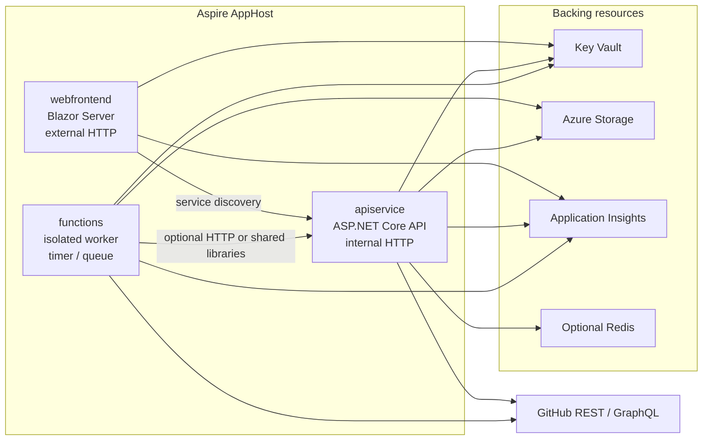

# Aspire from the start — multi-process findings

**Status:** Planning findings only. Not a decision. Does not change [DEC-013](DECISIONS.md#dec-013-aspire-for-local-orchestration), [DEC-015](DECISIONS.md#dec-015-aspire-azure-container-apps-deployment), or [SCOPE.md](SCOPE.md).  
**Date:** 2026-08-14  
**Audience:** Maintainer review before any split of the current single-process AppHost.

This note records how SoloDevBoard would look if Aspire had been used as a **distributed application model** from day one, and how Azure Functions (or Container App Jobs) would fit overnight, bulk GitHub housekeeping that the GitHub API does not expose as a single call.

No code, AppHost, or constitution changes are implied by this document.

---

## 1. What we have today

The AppHost models **one runnable project**: the Blazor Server UI, named `app`.

```28:40:src/SoloDevBoard.AppHost/AppHost.cs
var app = builder.AddProject<Projects.SoloDevBoard_App>("app")
    .WithHttpHealthCheck("/health")
    .WithExternalHttpEndpoints()
    .WithEnvironment("GitHubAuth__HostedSignInEnabled", hostedSignInEnabled)
    // ...
    .PublishAsAzureContainerApp((_, containerApp) =>
    {
        containerApp.Template.Scale.MinReplicas = 0;
        containerApp.Template.Scale.MaxReplicas = 1;
    });
```

That matches the incremental path in [ADR-0016](../adr/archive/0016-consider-aspire-for-local-orchestration-and-future-hosting.md): wire the existing web app into Aspire without restructuring the solution. The ADR already names the revisit trigger: *a second runtime or process is added (background worker, API, or service)*.

Other facts that matter for a later split:

- **Layered libraries are already in place.** `Domain`, `Application`, `Infrastructure`, and `Composition` are class libraries. `SoloDevBoard.Composition` is the DI composition root (`AddSoloDevBoard`); `SoloDevBoard.App` references Application and Composition only — not Infrastructure directly ([DEC-002](DECISIONS.md#dec-002-layered--clean-architecture), clarification 2026-08-30).
- **`ServiceDefaults` already prepares multi-process Aspire.** HTTP clients get service discovery and standard resilience, but nothing in the solution currently *consumes* another Aspire resource by name.
- **GitHub is called in-process from Blazor Server.** There is no HTTP API for labels, audit, triage, or migration. Cache is `IMemoryCache` scoped by user login — process-local, lost on scale-to-zero, and not shareable with a worker.
- **Hosted authentication lives on the web host.** Cookie sign-in, OAuth callback, and admission control are ASP.NET endpoints on `SoloDevBoard.App`. PAT mode injects a token into the same process.
- **Deployed Azure surface is one Container App** plus ACR, Log Analytics, Application Insights, and (in publish mode) Key Vault. See [docs/azure-costs.md](../docs/azure-costs.md). Idle cost is dominated by ACR and logs, not compute.

Aspire is already doing orchestration, parameters, Key Vault, ACA, and telemetry. What it is **not** doing is modelling more than one compute resource.

---

## 2. What “Aspire from the start” usually means

The Aspire starter (`aspire-starter`) is a **two-compute** graph, not a single website:

| Resource name (starter convention) | Role |
|---|---|
| `apiservice` | ASP.NET Core Minimal API (or controllers). Internal HTTP. Owns application use cases. |
| `webfrontend` | Blazor UI. External HTTP. Calls `apiservice` via `WithReference` and service discovery. |
| AppHost | Declares both, plus backing stores. |
| ServiceDefaults | Shared health, OTel, discovery, resilience. |

Typical AppHost shape (illustrative, not a proposed patch):

```csharp
var apiservice = builder.AddProject<Projects.SoloDevBoard_ApiService>("apiservice")
    .WithHttpHealthCheck("/health");

var webfrontend = builder.AddProject<Projects.SoloDevBoard_App>("webfrontend")
    .WithHttpHealthCheck("/health")
    .WithExternalHttpEndpoints()
    .WithReference(apiservice)
    .WaitFor(apiservice);
```

`WithReference(apiservice)` injects `services__apiservice__http__0` (and HTTPS equivalents). The web host would use `IHttpClientFactory` with a named client whose base address is `https://apiservice` (or `http://apiservice`), resolved by Aspire service discovery — the handler already registered in `ServiceDefaults`.

That is the minimum graph we would have had if the product had been treated as “UI plus backend” rather than “Blazor Server that *is* the backend”.

---

## 3. Recommended target graph (future)

A realistic SoloDevBoard AppHost, once bulk/offline work exists, is three compute resources plus backing stores — not two.



### 3.1 `webfrontend` (today’s `app`, thinned)

Keeps:

- Razor components, MudBlazor, theming.
- Hosted GitHub App cookie authentication, `/auth/*`, admission control.
- PAT-mode operator UX that does not need a GitHub round-trip beyond “am I signed in”.
- Health/alive endpoints for ACA.

Stops owning:

- Direct `ILabelManagerService` / `IGitHubService` calls from the circuit for catalogue and mutation work, once those live behind `apiservice`.
- In-process `IMemoryCache` as the GitHub catalogue cache (that cache would sit with the API or a shared Redis).

Auth callbacks **stay on the web host**. Moving OAuth to the API would split cookie issuance from the interactive circuit and complicate custom domains / `HostedSignInCallbackBaseUri`.

### 3.2 `apiservice` (new)

Owns:

- Application service implementations as HTTP (Minimal APIs mapping existing DTOs).
- Infrastructure GitHub clients, rate-limit-aware pagination, catalogue cache.
- Snapshot reads for overnight scan results (OSS health, FUNDING, and similar).
- Health checks including GitHub connectivity (`/health/github` today).

Should **not** be published with `WithExternalHttpEndpoints()` on a public hosted deployment. The Container App stays internal to the ACA environment; only `webfrontend` is public. Self-hosters who currently run a single URL would still hit the web app only.

DEC-008 still applies: HTTP contracts are Application DTOs (or API-specific request/response records mapped from DTOs). Domain entities do not leave Application.

Composition: `apiservice` becomes a second composition root that calls the same `AddSoloDevBoard` extension from `SoloDevBoard.Composition`. A future Functions worker should also reference Composition rather than wiring Infrastructure from `SoloDevBoard.App`.

### 3.3 `functions` (new, when overnight work exists)

Aspire 13.4 models this as `AddAzureFunctionsProject<T>("functions")` from `Aspire.Hosting.Azure.Functions`. Constraints from current Aspire docs:

- Isolated worker model only (not in-process).
- .NET 8+ (we would target `net10.0` to match the solution).
- Implicit Azure Storage as Functions host storage (Azurite locally via `AddAzureStorage(...).RunAsEmulator()` + `WithHostStorage`).
- On ACA deploy, kind is `functionapp` so KEDA rules can follow triggers.
- First-class triggers in the Aspire integration: Timer, HTTP, Storage Queue/Blob, Service Bus, Event Hubs, Cosmos DB. Other triggers are **not** currently supported by the integration.

Timer triggers are the natural fit for “review all my repos overnight”. They need no extra messaging resource beyond host storage.

Functions should call **Application use cases** (scan/write snapshot), not scrape Razor pages, and should not duplicate GitHub HTTP mapping. Prefer referencing `SoloDevBoard.Composition` (or Application + Infrastructure as libraries) from the Functions host, *or* calling `apiservice` over HTTP. Library reference via Composition is simpler for long-running scans (no HTTP timeouts, easier cancellation and progress). HTTP is better if you want a single GitHub-rate-limit chokepoint. Those two options should be chosen when the first scanner is specified — not both.

### 3.4 Optional backing stores

| Store | When it becomes necessary |
|---|---|
| Azure Storage (blobs/tables) | Functions host storage (mandatory if Functions exist). Also a cheap place for scan snapshots (JSON per owner, or table rows per repo). |
| Redis | Only if `webfrontend` and `apiservice` both need a shared hot catalogue cache, or multiple API replicas appear. Not required while ACA `MaxReplicas = 1`. |
| Azure SQL / Cosmos | Only if scan history, acknowledgements, or ignore-lists become first-class product data. Avoid until a scanner needs queryable history. |
| Service Bus / Storage Queue | Fan-out across hundreds of repos, or “user clicked Apply FUNDING to 40 repos”. Durable Functions + task hub is the Aspire-supported alternative for fan-out. |
| User preferences (PM settings) | When SQL/Cosmos or equivalent per-user storage is provisioned for first-class product data. **Interim:** browser `localStorage` per [DEC-029](DECISIONS.md#dec-029-cross-repo-planning-board-selection-and-local-settings) ([#383](https://github.com/markheydon/solo-dev-board/issues/383)). **Refactor:** [#391](https://github.com/markheydon/solo-dev-board/issues/391). |

Do not add a database solely to look like a starter template. GitHub remains the system of record for live mutations. Persistence is for **derived snapshots**, **job state**, and (when justified) **user preferences** that must outlive a single browser profile.

---

## 4. Why the single-process model was rational — and where it breaks

Blazor Server plus in-process Application services is a good fit for **interactive, user-driven** GitHub work: triage one issue, preview a label sync, apply a workflow template. Those flows are request-scoped, user-token-scoped, and already paginated/cached (#254).

It breaks for:

- **Work that must outlive a circuit.** Overnight scans, or “check 80 repos for FUNDING.yml”, will hit Blazor circuit timeouts, ACA idle scale-down, and GitHub secondary rate limits if driven from a page load.
- **Work that is not a GitHub bulk API.** GitHub has no “give me OSS-compliance for all repos I admin” endpoint. The product must enumerate repos and issue per-repo calls. That is a job, not a dashboard query.
- **A second consumer.** A Function, a CLI, or a future mobile client cannot reuse Razor-injected services. They need either libraries hosted in another process or an HTTP API.
- **Scale-to-zero vs always-on jobs.** The UI can scale to zero. A 02:00 timer must wake a different compute shape (Functions or a scheduled Container App Job), not pin the Blazor replica at 1.

ADR-0016’s revisit condition is therefore the right gate: introduce `apiservice` when a second process is real, not as ceremony before v1.0.0.

---

## 5. Overnight / bulk use cases (no GitHub bulk API)

These are examples of **derived compliance views**: gather facts overnight, show them in the UI next day, optionally apply fixes in a preview-first interactive pass (existing Label Manager / Migration pattern).

### 5.1 OSS community health

GitHub exposes a **per-repository** community profile, not an organisation-wide roll-up:

- `GET /repos/{owner}/{repo}/community/profile` — README, licence, contributing, code of conduct, issue/PR templates (where GitHub has indexed them).
- Individual contents checks for files GitHub does not always fold into that payload, for example `SECURITY.md`, `SUPPORT.md`, `CODEOWNERS`, `CITATION.cff`.

A scanner would:

1. List repositories the installation or PAT can admin (reuse existing catalogue logic; respect docs-capture public-only filtering if that mode is on).
2. For each repo, call community profile + targeted contents GETs.
3. Write a snapshot: repo, missing files, licence SPDX if present, last scanned UTC, HTTP/rate-limit metadata.
4. Surface in the Audit Dashboard (or a new “Repo hygiene” page) as **cached facts**, with a “scan now” that enqueues a job rather than blocking the circuit.

### 5.2 FUNDING files

Sponsors discovery is file-based:

- `GET /repos/{owner}/{repo}/contents/.github/FUNDING.yml` (and sometimes `FUNDING.yml` at repo root).
- Organisation `.github` repo can hold a default FUNDING file; per-repo files override. There is still no “list funding status for all repos” API.

A scanner would record presence/absence and parsed platforms (github, ko-fi, and so on). An **apply** action (copy a canonical FUNDING.yml, like workflow templates) stays interactive and preview-first — Functions gather; the API/UI mutate.

GitHub Sponsors billing and marketplace monetisation remain out of scope for v1.0.0 per [SCOPE.md](SCOPE.md). A FUNDING.yml presence check is hygiene, not a billing product.

### 5.3 Other bulk-but-not-bulk-API candidates

Same job pattern, different probes:

- Standard community files under `.github/` that workflow templates do not already manage.
- Dependabot / secret scanning alerts summaries (per-repo REST).
- Stale fork or archived-but-still-listed inventory.
- “Does this public repo still match our label taxonomy?” as a nightly diff, feeding Label Manager instead of computing it on every page load.

Rule of thumb: if GitHub needs **N repo calls** and N can exceed a comfortable interactive budget, it is a Function (or Job), not a Blazor `OnInitializedAsync`.

### 5.4 Rate limits and tokens

- PAT and GitHub App installation tokens are **per-resource rate limited**. A naive parallel fan-out across 100 repos will 403.
- Background jobs cannot use the hosted **user cookie**. They need an installation token (hosted) or the operator PAT (local/self-host). That is a different trust boundary from “the signed-in user clicked Apply”.
- Snapshots should be tagged with **which identity produced them** (installation vs user) so the UI does not present another user’s scan as current.
- Secondary rate limits reward sequential or low-concurrency Durable fan-out with delay, not `Task.WhenAll` over the whole catalogue.

---

## 6. Azure Functions versus Azure Container App Jobs

Aspire supports both. They are not interchangeable.

| | Azure Functions (timer) | Scheduled Container App Job |
|---|---|---|
| AppHost API | `AddAzureFunctionsProject` + `TimerTrigger` | `AddProject` + `PublishAsScheduledAzureContainerAppJob("0 0 * * *")` |
| Local run | Functions host + Azurite in the dashboard | Runs as a normal project/worker locally; schedule is a **publish-time** concern |
| Host storage | Required | Not required unless the worker uses Storage itself |
| Scaling | KEDA from function triggers on ACA | Job replica runs, exits |
| Fan-out / checkpoint | Durable Functions + task hub (Aspire-supported) | You build your own |
| Best when | Recurring scans, queues, blobs, retries, dashboard logs as a first-class resource | Simple “run this console once a night and exit” |

**Recommendation for SoloDevBoard:** prefer **Azure Functions** if we expect more than one trigger (nightly OSS scan, queue-driven “scan this repo now”, blob-triggered import). Prefer a **scheduled Container App Job** if the first slice is a single nightly console that writes one snapshot and exits, and we want to avoid Functions host storage cost.

Do not run long GitHub crawls inside the Blazor Container App via `IHostedService` + cron. That fights scale-to-zero and couples job failures to the interactive site.

---

## 7. Authentication and secrets in a multi-process AppHost

Today, PAT and GitHub App client secret are AppHost parameters, bound to `app` (and to Key Vault in publish mode). In a split graph:

- **Web:** still needs GitHub App client id/secret for the OAuth dance, plus cookie auth.
- **API:** needs a GitHub token **per incoming request** for user-driven calls (forward installation or user token from the web), and/or the operator PAT for PAT mode.
- **Functions:** need a **non-interactive** credential only (installation token or PAT). Never the browser cookie.

Token forwarding (web → API) is the hardest design point and should be specified before any split:

1. Web obtains the GitHub token from the cookie/session (already true in hosted mode).
2. Web calls `apiservice` with `Authorization: Bearer …` over the ACA internal network (HTTPS).
3. API never persists that user token.
4. Functions use a separately injected installation token from Key Vault, not the user’s session.

PAT mode stays simpler: inject `gh-pat` into API and Functions; web may not need GitHub at all except connectivity UX that then calls the API.

Key Vault stays the publish-mode secret store ([DEC-017](DECISIONS.md#dec-017-key-vault-backed-hosted-auth-secrets)). Each new compute resource that needs secrets gets `WithRoleAssignments` + `WithReference` on the same `auth-secrets` vault (or a dedicated `job-secrets` vault if we want blast-radius separation later).

---

## 8. Layering and testing implications

- **Domain / Application** stay libraries. New scan use cases (`IOssHygieneScanService`, snapshot DTOs) live in Application. GitHub community-profile mapping lives in Infrastructure.
- **App** remains presentation. After a split it talks HTTP + DTOs, still never Domain entities (DEC-008).
- **bUnit** continues to mock Application interfaces *or* an `ISoloDevBoardApiClient`. Prefer a typed client generated from the API contract rather than leaking `HttpClient` into components.
- **Playwright** still hits `webfrontend` only. Internal `apiservice` is not a user journey.
- **DEC-016** still says do not test AppHost modelling. Test scan logic in Application/Infrastructure unit tests; test Functions handlers with the Functions worker test helpers if we add them.
- E2E docs-capture stays on the UI. Snapshot-backed pages need a way to seed fake snapshots in CI (placeholder auth already yields empty/error shells).

---

## 9. Cost and operations

Compared with today’s single scale-to-zero Container App:

- **`apiservice` as a second Container App** — another consumption bill. If the web always calls the API, both may wake on first user request (two cold starts) unless they share min replicas. Consider keeping API min=0 as well, or min=1 only if jobs need it up (jobs should not require the API if they use libraries).
- **Functions / Jobs** — billed per execution. A nightly scan of tens of repos is cheap relative to ACR. Host storage (Functions) is a new always-on Azure Storage account.
- **Application Insights** — already provisioned; additional resources should `WithReference` the same `app-insights` resource rather than creating a second workspace.
- **Self-hoster PAT path** — `aspire deploy` would provision more resources. Document the extra SKUs in `docs/azure-costs.md` *when* this is implemented, not before.

Idle cost will rise modestly (Storage + possibly a second Container App). The point of the split is operational correctness for jobs, not cost reduction.

---

## 10. Suggested adoption sequence (when we choose to do this)

Do **not** block v1.0.0 on this. Sequence for a later phase:

1. **Keep the monolith** until the first overnight scanner has a GitHub issue, acceptance criteria, and a wireframe for how snapshots appear in the UI.
2. **Extract `apiservice`** only if the scanner *or* a second client needs HTTP. If the first scanner can be a Functions project referencing `SoloDevBoard.Composition`, an API split can wait. The Aspire starter’s `apiservice` is valuable once the UI and a worker would otherwise duplicate composition.
3. **Add Storage + Functions (or a scheduled Job)** for the first scanner. Persist snapshots. Teach Audit (or a new page) to read snapshots with an explicit “last scanned” timestamp and stale-data copy.
4. ~~**Thin the Blazor composition root** so Infrastructure is no longer referenced from App~~ **Done (2026-08-30):** `SoloDevBoard.Composition` owns DI wiring; App references Application and Composition only.
5. **Rename** AppHost resource `app` → `webfrontend` when it is no longer the only compute resource, so dashboard and `aspire logs` names match Aspire convention. Coordinate CD health checks and docs that say `aspire logs app`.
6. Record a decision log entry (next DEC) only when we commit to the split. This findings file is not that decision.

A greenfield “Aspire from day one” would have started at step 2 with an empty API and moved GitHub out of the UI immediately. Retrofitting that now, without a second process, would be churn: two containers, token forwarding, and doubled cold start, for the same user journeys.

---

## 11. Open questions for review

- Should the first bulk feature be OSS community health, FUNDING.yml, or label-taxonomy drift? That choice drives the snapshot schema.
- For hosted multi-user later (DEC-005), are overnight scans **installation-scoped** (one snapshot per GitHub App installation) or **user-scoped**?
- Is an internal `apiservice` mandatory before Functions, or may Functions reference Infrastructure directly for v1 of scanners?
- Timer Function versus scheduled Container App Job for the first scanner (see section 6).
- Where do users **acknowledge** or **ignore** findings (UI-only, or persisted so the next scan does not nag)? Persistence requirement follows from that.
- Public hosted deployments: should scan-apply mutations be disabled unless the operator is on the admission allow-list *and* the installation can write to the target repo? (Almost certainly yes.)

---

## 12. Sources

- Current AppHost: `src/SoloDevBoard.AppHost/AppHost.cs`.
- ADR-0016 / DEC-013, DEC-015, DEC-017.
- Aspire 13.4.6 docs (CLI `aspire docs`): Azure Functions hosting, runtime configuration, supported triggers, Azure Container App Jobs. Versions in this note were current at the time of writing (2026-08-14); the repo now targets Aspire 13.5.0.
- Package discovery: `Aspire.Hosting.Azure.Functions` 13.4.6 via `aspire integration search azure-functions`.

---

## 13. What this document is not

- Not a constitution change.
- Not a scope change (overnight scanners are **future considerations**, not v1.0.0).
- Not an implementation plan with issue numbers. Create GitHub issues only after this review accepts a direction.
- Not a licence to add Redis, SQL, or Functions “because Aspire can”.
