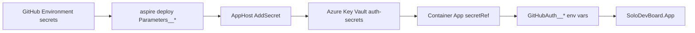

# Hosted Authentication Key Vault Pattern

Date: 2026-07-24.  
Issue: #250.  
Applies to: Epic #101, Feature #103, [DEC-015](DECISIONS.md#dec-015-aspire-azure-container-apps-deployment), [DEC-017](DECISIONS.md#dec-017-key-vault-backed-hosted-auth-secrets).

## Purpose

Define how hosted authentication secret material is persisted in Azure Key Vault when SoloDevBoard is deployed to Azure Container Apps, while preserving direct AppHost parameter binding for local development.

## Scope

| Material | Storage at deploy time | Local development |
|---|---|---|
| `gh-app-client-secret` | Azure Key Vault secret `gh-app-client-secret` | Aspire user secrets / dashboard parameter |
| `gh-pat` | Azure Key Vault secret `gh-pat` | Aspire user secrets / dashboard parameter |
| `gh-app-client-id` | Container App environment variable (non-secret) | AppHost parameter |
| `hosted-sign-in-enabled` | Container App environment variable (non-secret) | AppHost parameter |
| `hosted-admission-enabled` | Container App environment variable (non-secret) | AppHost parameter |
| `allowed-user-logins` | Container App environment variable (non-secret) | AppHost parameter |
| `allowed-org-logins` | Container App environment variable (non-secret) | AppHost parameter |

Hosted user access tokens remain in the authentication cookie and are not persisted to Key Vault. Per-user vault naming from [ADR-0007](../adr/archive/0007-multi-tenancy-authentication-phased-approach.md) Phase 5 remains deferred.

## Pattern

1. **AppHost models Key Vault only in publish mode.** `aspire start` continues to bind secret parameters directly to the `app` resource. `aspire deploy` provisions an `auth-secrets` Key Vault, writes secret parameters into the vault, and maps them to Container App environment variables via Key Vault references.
2. **Deploy-time input is unchanged.** Operators and GitHub Actions still supply `Parameters__gh_pat` and `Parameters__gh_app_client_secret` at deploy time. Aspire persists those values into Key Vault during deployment; they are not stored in the container image or plain-text app settings.
3. **Least-privilege RBAC.** The Container App managed identity receives the **Key Vault Secrets User** role on the `auth-secrets` vault. The default Key Vault Administrator role is not used for runtime secret access.
4. **Application code is unchanged.** The web app continues to read `GitHubAuth__PersonalAccessToken` and `GitHubAuth__HostedGitHubAppClientSecret` from configuration. Container Apps resolves Key Vault references into environment variables before the process starts.
5. **No hand-authored Bicep.** Key Vault provisioning and secret wiring are generated by Aspire from `AppHost.cs`, consistent with [DEC-015](DECISIONS.md#dec-015-aspire-azure-container-apps-deployment).

## Operator flow

1. Configure `GH_PAT` and `GH_APP_CLIENT_SECRET` in the GitHub deployment environment (or export `Parameters__*` for local `aspire deploy`).
2. Run `aspire deploy` from `SoloDevBoard.AppHost`.
3. Aspire creates or updates the `auth-secrets` Key Vault and stores the secret parameters.
4. The Container App receives `GitHubAuth__PersonalAccessToken` and `GitHubAuth__HostedGitHubAppClientSecret` as platform-managed Key Vault references.
5. Rotate a secret by updating the GitHub Environment secret (or local parameter) and re-running deploy.

## Out of scope

- Runtime `SecretClient` usage inside `SoloDevBoard.App`.
- Connecting to a pre-existing Key Vault (`AsExisting`); a future issue can add that if operators require a central vault.
- OAuth App fallback secret material (only introduced when fallback criteria in [DEC-012](DECISIONS.md#dec-012-github-app-first-hosted-authentication) are met).

## References

- [AppHost](../src/SoloDevBoard.AppHost/AppHost.cs)
- [AppHost README](../src/SoloDevBoard.AppHost/README.md)
- [Deployment guide](../docs/deployment.md)
- [Aspire Key Vault hosting integration](https://aspire.dev/integrations/cloud/azure/azure-key-vault/azure-key-vault-host/)
