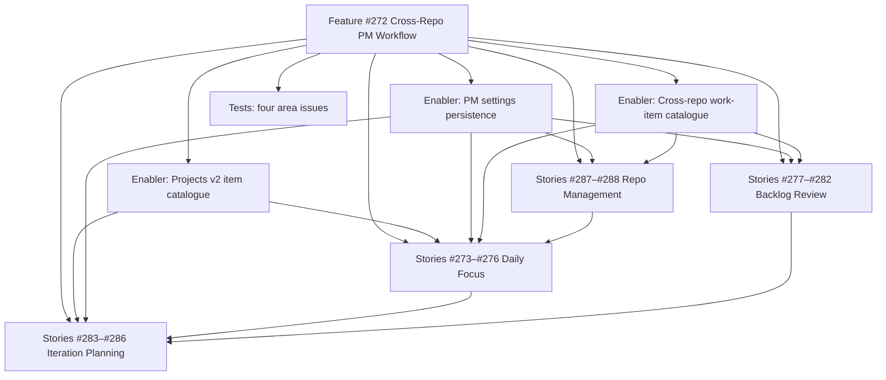

# Cross-Repo PM Workflow — project plan

## Project overview

### Feature summary

Ship a visual two-mode PM operating system inside SoloDevBoard (feature [#272](https://github.com/markheydon/solo-dev-board/issues/272), milestone **v1.1.0**). PM Mode (weekly/fortnightly) reviews the backlog and curates **Up Next**. Work Mode (daily) uses Daily Focus as a morning nudge while the selected Projects v2 board remains the execution pane of glass.

The sixteen child stories (#273–#288) were created as one-line stubs. This plan specifies them as slices of **four pages**, plus three **enablers** (API and settings) and four **test** issues. [#272](https://github.com/markheydon/solo-dev-board/issues/272) stays a Feature with no parent Epic (DEC-027 catch-up exception).

### Success criteria

- A signed-in user can select a planning board and see Status occupancy plus active load.
- Daily Focus lists stalled Up Next items, stalled review PRs, and three recommended unblocked items.
- Backlog Review groups cross-repo issues and PRs by urgency, flags missing `type/` or `priority/` labels, near-complete epics, and neglected repositories.
- Iteration Planning moves selected items to Up Next with Focus Order, enforces a soft capacity limit, and requires stalled Up Next resolution first.
- Excluded repositories persist in the browser and are omitted from PM queries (except raw board occupancy).
- User guide `website/content/docs/pm-workflow.md` is published when the four pages match the guide; Playwright maps the published page.

### Key milestones (no calendar dates)

1. Enablers: project item GraphQL, work-item catalogue, localStorage settings.
2. Repo Management UI (board, exclusions, thresholds, per-repo counts).
3. Daily Focus read-only view.
4. Backlog Review read-only view.
5. Iteration Planning writes (Up Next, stall resolution, optional milestone).
6. Tests, user guide, E2E alignment, docs-capture screenshots.

### Risk assessment

| Risk | Mitigation |
|------|------------|
| No project-item **read** API today | Enabler ships GraphQL item catalogue before UI stories. |
| Hosted App cannot see private user-owned boards | Reuse inaccessible-board warning; PAT mode remains the path for private boards (#293). |
| Rate limits from fan-out across many repos | Bound parallelism; reuse Audit-style per-repo fetch; do not cache issue lists unless a follow-up to DEC-018 is recorded. |
| Stall clock without Status-changed-at | Prefer field-updated timestamp; document fallback to item `updatedAt`. |
| Overlapping stories (#280, #282 vs #277) | Same page, incremental acceptance criteria; do not add extra routes. |

## Work item hierarchy

## GitHub issues breakdown

See [cross-repo-pm-workflow-issues-checklist.md](cross-repo-pm-workflow-issues-checklist.md) for labels, sizes, and blocking edges.

### Pages and MudBlazor

| Page | MudBlazor first | Avoid |
|------|-----------------|-------|
| Shell | `MudTabs` / `MudSelect` / `MudAlert` / `MudButton` | Custom tab CSS |
| Daily Focus | `MudPaper` KPI chips, `MudSimpleTable` or `MudList` | Hard-coded Project #8 option ids |
| Backlog | `MudExpansionPanels`, `MudChip`, `MudTextField` search | Duplicate Audit Dashboard layout |
| Planning | `MudProgressLinear` capacity, `MudDialog` confirm, `MudCheckBox` picker | Unconditional writes |
| Repos | `MudNumericField`, `MudSwitch`/`MudChip` exclude list, `MudTable` | Server database |

### Technical approach (enablers)

1. **Projects v2 item catalogue** — extend `IGitHubService` with GraphQL `node(id: project) { ... on ProjectV2 { items { ... Status, Focus Order, content, updatedAt } } } }` plus writes already used by Triage (`updateProjectV2ItemFieldValue` for Status and number Focus Order). Discover field ids from the board, same as Status options today.
2. **PM settings** — `IPmSettingsService` + JS localStorage (mirror theme preference). Defaults: capacity 8, stall days 3, neglect days 14, empty exclusion list.
3. **Work-item catalogue** — fan-out `GetIssuesAsync` / `GetPullRequestsAsync` across included repos; map to `PmWorkItemDto` with labels, milestone, URL, updated-at. Label helpers for `type/`, `priority/`, `status/`. Epic-near-complete uses GraphQL sub-issue summary on open `type/epic` (and `type/feature` if useful) issues.

### Definition of done (feature)

- [ ] All child stories, enablers, and tests closed or explicitly deferred.
- [ ] Wireframe behaviour present on the four routes.
- [ ] Unit tests for services; bUnit for page shells; Playwright spec for `/pm-workflow` empty/error/nav.
- [x] `website/content/docs/pm-workflow.md` published (not draft) and `tests/E2E/USER_DOCS_ALIGNMENT.md` updated.
- [ ] No secrets in localStorage.

## Priority and value

| Slice | Priority | Notes |
|-------|----------|--------|
| Enablers | `priority/high` | Critical path |
| Repo Management | `priority/high` | Unlocks correct query scope |
| Daily Focus | `priority/high` | First user-visible value |
| Backlog Review | `priority/medium` | PM Mode |
| Iteration Planning | `priority/medium` | Writes; after read views |
| Tests | `priority/medium` | Pair with each slice |

## Dependency management

**Blocking (must set in GitHub UI or via GraphQL):** listed in the issues checklist.

**Related, not blocking:** #293 (hosted private boards), Audit Dashboard reuse, Triage board discovery, DEC-014 Roadmap Sync (reference for Status semantics, not a runtime dependency).

## Implementation references

- Wireframe: `plan/wireframes/pm-workflow-wireframe.md`
- Decisions: DEC-008, DEC-018, DEC-027, DEC-028, DEC-029
- User guide stub: `website/content/docs/pm-workflow.md`
- Access limitation: `plan/GITHUB_PROJECTS_V2_ACCESS.md`
