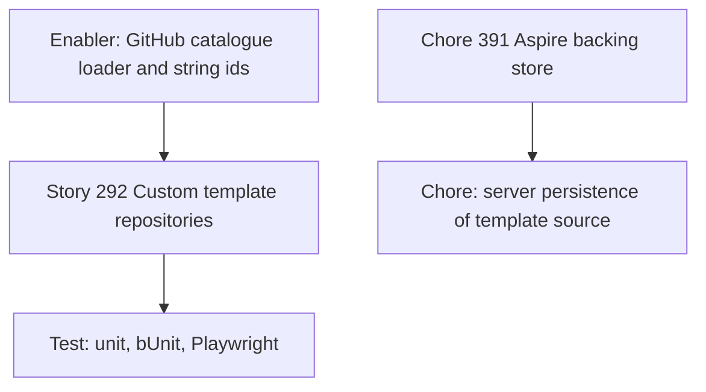

# Custom template repositories — project plan

**Story:** [#292](https://github.com/markheydon/solo-dev-board/issues/292)  
**Enabler:** [#497](https://github.com/markheydon/solo-dev-board/issues/497)  
**Test:** [#499](https://github.com/markheydon/solo-dev-board/issues/499)  
**Persistence follow-on:** [#498](https://github.com/markheydon/solo-dev-board/issues/498) (blocked by [#391](https://github.com/markheydon/solo-dev-board/issues/391))  
**Milestone:** `v1.2 - Planning polish, Reload & Templates`  
**Wireframe:** [`plan/wireframes/workflow-templates-wireframe.md`](wireframes/workflow-templates-wireframe.md)  
**Decision:** [DEC-038](DECISIONS.md#dec-038-custom-actions-template-sources)

## Feature summary

Solo developers can point Actions Templates at one GitHub repository of workflow YAML, choosing from their repository catalogue or typing an `owner/name` outside that list. Those files join the built-in catalogue for preview, inferred parameterisation, apply, and drift. Last-used `owner/name` is remembered in localStorage only.

## Success criteria

- Built-in templates still work with no source selected or entered.
- The custom source section offers a single-select `RepositorySelector` plus a manual `owner/name` field; both sync to one source value and Load is explicit.
- A valid `owner/name` with `.github/workflows` YAML appears as extra cards with a source badge.
- Apply and drift use the selected template content, including inferred `{{token}}` values.
- Custom-source failures do not hide built-ins.
- User Guide “coming later” copy for custom repositories is replaced when this ships.
- Persisted parameter profiles ([#436](https://github.com/markheydon/solo-dev-board/issues/436)) stay ice-boxed.

## Work item hierarchy

The persistence chore is **not** a child of #292. #292 can close when localStorage last-used behaviour ships.

## Out of increment

- Multiple custom sources at once.
- Sidecar metadata, front-matter, or `github/starter-workflows` properties files.
- In-app YAML authoring or publish-back.
- Operator appsettings lists of template repos.
- [#436](https://github.com/markheydon/solo-dev-board/issues/436) parameter profiles.
- Nested workflow directories below `.github/workflows`.

## Risks

| Risk | Mitigation |
|------|------------|
| Integer template ids collide with custom files. | Change public DTOs and service methods to string ids (`builtin:…`, `custom:owner/repo:path`). |
| Listing `.github/workflows` needs a new GitHub contents API. | Extend `IWorkflowFileRepository`; reuse DEC-018 caching. |
| Inferred parameters have no labels or defaults. | Token name is the label; all inferred fields are required. |
| Hosted App cannot read a private template repo. | Same token as other GitHub reads; show a clear access error. |

## Delivery sequence

1. Enabler: directory list, fetch YAML, infer tokens, merge catalogue, string ids.
2. Story UI: source selector plus manual field, Load (aligned to the manual field row), last-used localStorage, badges, error/empty states.
3. Tests and User Guide / E2E alignment.
4. Persistence chore stays blocked until [#391](https://github.com/markheydon/solo-dev-board/issues/391).
