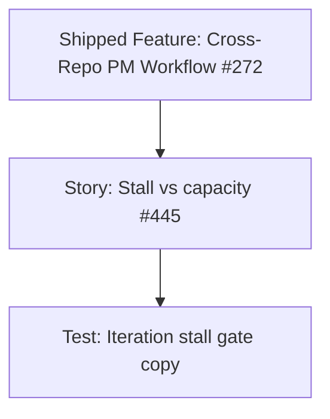

# Iteration Planning stall versus capacity — project plan

## Feature summary

Make Iteration Planning (`/pm-workflow/planning`) explain **one hard brake** when stalled Up Next items exist, and keep capacity as a **meter plus confirm**, not a second lock.

Story (no new Feature parent — catch-up on shipped Feature [#272](https://github.com/markheydon/solo-dev-board/issues/272) per [DEC-027](DECISIONS.md#dec-027-post-10-milestone-and-work-item-hierarchy)):

- [#445](https://github.com/markheydon/solo-dev-board/issues/445) — separate stall gate from capacity on Iteration Planning.

No new architecture decision. Behaviour of `IsAddToUpNextDisabled` (stall only) and the **Exceed capacity limit?** dialog stays as shipped.

## Success criteria

- When any stalled Up Next item exists, a single error-severity alert states that Add to Up Next is blocked until those rows are handled, with count and next actions (Re-commit, Mark Blocked, Ice Box, Remove). The stall message must not use the word “capacity”.
- Capacity N/N remains status. Inner Up Next copy must not claim the user must resolve items before adding when the only issue is a full meter.
- The candidate list stays visible. A short pause line explains that Add is paused until stalled Up Next is cleared. Optional tooltip on disabled Add.
- User Guide Iteration section and Playwright `/pm-workflow/planning` coverage match the copy and severity.

## Key milestones

1. Planning artefacts and wireframe update.
2. Deliver #445 (copy, severity, candidate pause line).
3. Tests and User Guide alignment.

## Risks

| Risk | Mitigation |
|------|------------|
| Delivery accidentally hard-stops at capacity | Do not change `IsAddToUpNextDisabled` to include capacity. Keep the exceed-capacity dialog. |
| Two long warning banners remain | One error stall alert; capacity stays a meter, not a second essay. |
| Candidate picker looks empty when paused | Keep the list; disable Add with a one-line reason. |

## Work item hierarchy

Independent of Label Manager dogfood (#444, #446). Can run in parallel.

## Priority and estimate

| Item | Priority | Size |
|------|----------|------|
| Story #445 | `priority/medium` | `size/s` |
| Test | `priority/medium` | `size/s` |

## Out of scope for this increment

- Making full capacity a hard stop.
- Auto-scroll or focus the stall table on load (optional later).
- Changing stall-day calculation or Re-commit GraphQL behaviour.
- Private user-owned Projects v2 under hosted sign-in ([#293](https://github.com/markheydon/solo-dev-board/issues/293)).

## Implementation references

- Wireframe: [`plan/wireframes/pm-workflow-wireframe.md`](wireframes/pm-workflow-wireframe.md)
- Feature plan: [`plan/cross-repo-pm-workflow-project-plan.md`](cross-repo-pm-workflow-project-plan.md)
- User Guide (update during delivery): [`website/content/docs/pm-workflow.md`](../website/content/docs/pm-workflow.md)
- Implementation notes: `IsAddToUpNextDisabled` when `planningView.StalledUpNextItems` is non-empty (`PmWorkflowPlanningPanel.razor.cs`)
