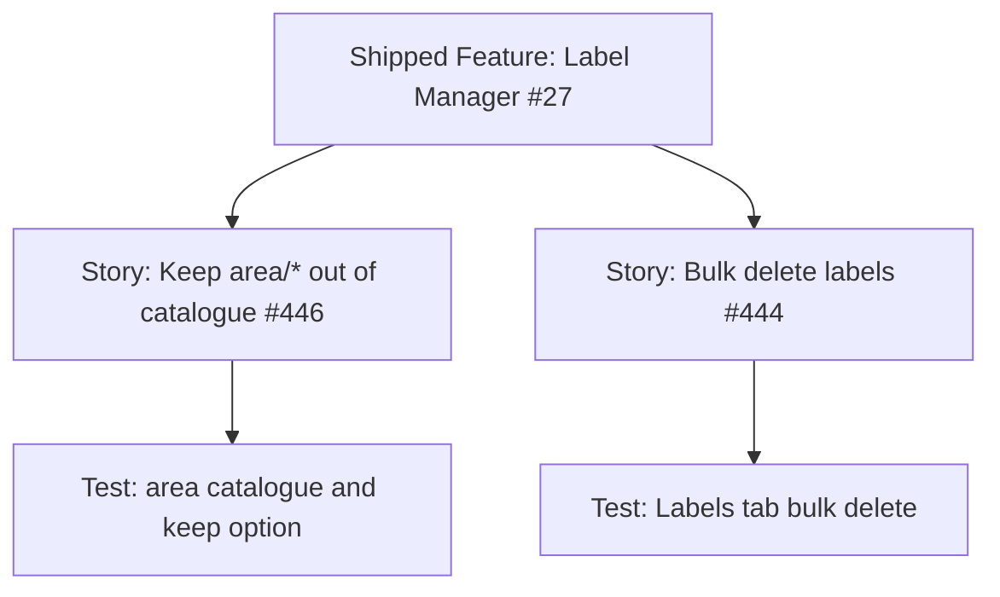

# Label Manager v1.1 dogfood — project plan

## Feature summary

Close two Label Manager dogfood gaps on milestone **v1.1.0**: stop exporting this repository's `area/*` map through the built-in recommended catalogue, and add multi-select bulk delete on the Labels tab.

Stories (no new Feature parent — catch-up on shipped Feature [#27](https://github.com/markheydon/solo-dev-board/issues/27) per [DEC-027](DECISIONS.md#dec-027-post-10-milestone-and-work-item-hierarchy)):

- [#446](https://github.com/markheydon/solo-dev-board/issues/446) — keep `area/*` out of built-in taxonomy cleanup.
- [#444](https://github.com/markheydon/solo-dev-board/issues/444) — bulk delete labels in Label Manager.

Decision: [DEC-034](DECISIONS.md#dec-034-label-manager-recommended-catalogue-omits-area-labels).

## Success criteria

- Applying **Recommended taxonomy** or **Synchronise** to a repository that is not `solo-dev-board` does not create SoloDevBoard `area/*` labels from the built-in catalogue.
- With **Remove labels outside taxonomy** on, a nested **Keep `area/*` labels** option (default on) prevents those names from being deleted as extras; unchecking it restores extra-delete behaviour for `area/*`.
- The same keep-versus-delete rule applies to Synchronise extra deletes.
- On the Labels tab, the user can select one or more rows, confirm **Are you sure?**, and delete those labels from every selected repository that currently has them, continuing after per-item GitHub errors.
- User Guide and Playwright `/labels` coverage match the new controls.

## Key milestones

1. Planning artefacts, wireframe update, DEC-034, size labels, test issues.
2. Deliver #446 (catalogue + nested keep option).
3. Deliver #444 (grid multi-select + bulk delete).
4. Tests and User Guide alignment.

## Risks

| Risk | Mitigation |
|------|------------|
| Operators still want SoloDevBoard areas on other repos | Out of scope for v1.1.0. They can create `area/*` labels manually. Do not add app-settings prefix lists yet. |
| Nested checkbox copy contradicts “delete every label not in the strategy” | Helper text must say `area/*` is an explicit keep exception when the nested box is checked. |
| Bulk delete stops on first API failure (current single-label path) | Follow taxonomy-apply: continue the batch and report per-label / per-repository errors. |
| GitHub has no bulk-delete REST endpoint | Loop `DELETE /repos/{owner}/{repo}/labels/{name}`; disable double-submit while the batch runs. |

## Work item hierarchy

#446 and #444 are independent. Recommended delivery order: **#446 first** so dogfooding Recommended taxonomy on other repositories is safe, then #444.

## Priority and estimate

| Item | Priority | Size |
|------|----------|------|
| Story #446 | `priority/medium` | `size/s` |
| Story #444 | `priority/medium` | `size/m` |
| Test (area keep) | `priority/medium` | `size/s` |
| Test (bulk delete) | `priority/medium` | `size/s` |

## Out of scope for this increment

- Per-repository area overlays or creating `area/*` labels in Label Manager.
- Configurable keep/ignore prefix lists in app settings.
- Protecting GitHub default labels from bulk delete (Label Manager CRUD has no allow-list today).
- Project board column migration ([#291](https://github.com/markheydon/solo-dev-board/issues/291)) and custom template repositories ([#292](https://github.com/markheydon/solo-dev-board/issues/292)) — unmilestoned until the next release is declared.

## Implementation references

- Wireframe: [`plan/wireframes/label-manager-wireframe.md`](wireframes/label-manager-wireframe.md)
- Decision: [DEC-034](DECISIONS.md#dec-034-label-manager-recommended-catalogue-omits-area-labels)
- This repository's areas: [`plan/LABEL_STRATEGY.md`](LABEL_STRATEGY.md)
- User Guide (update during delivery): [`website/content/docs/label-manager.md`](../website/content/docs/label-manager.md)
- Catalogue code: `RecommendedLabelTaxonomyCatalog` (`area/dashboard`, `area/migration`, `area/labels`, `area/board-rules`, `area/triage`, `area/workflows`, `area/infrastructure`, `area/docs`)
