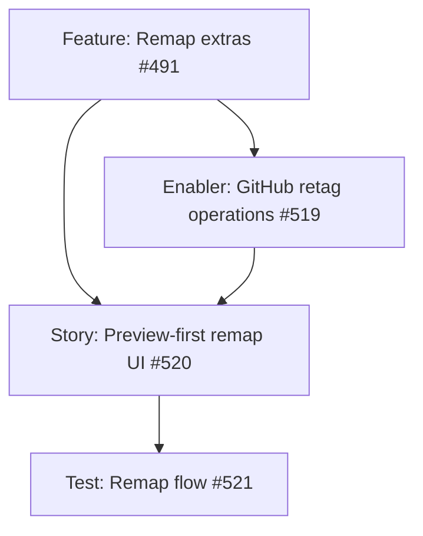

# Remap existing labels onto the recommended taxonomy — project plan

## Feature summary

Label Manager can already create the built-in SoloDevBoard taxonomy and delete extras. Deleting extras **removes the label from every issue and pull request**. This feature adds a **preview-first remap** on an existing repository: map old names onto taxonomy (or other existing) names, apply the destination to every issue and pull request that used the source, then delete the source.

Feature [#491](https://github.com/markheydon/solo-dev-board/issues/491) on milestone **`v1.3 - Usable solo workflow across repositories`**. It extends shipped Label Manager ([#27](https://github.com/markheydon/solo-dev-board/issues/27)) and has no parent Epic ([DEC-027](DECISIONS.md#dec-027-post-10-milestone-and-work-item-hierarchy) catch-up: completing a shipped feature). One-Click Migration stays out of this slice.

`v1.3` is the first post-`v1.2.0` increment: dogfood a usable solo workflow across repositories. Remap is the locked-in start so existing catalogues can adopt the taxonomy without wiping history. Further workflow gaps will be filed from daily use, not invented here.

## Success criteria

- Given `story` and `type/story` on the same repository, mapping `story` → `type/story` retags issues and pull requests (other labels kept) and then deletes `story`.
- Leaf-name suggestions pre-fill destinations (`story` → `type/story`); the user can change or skip.
- Keep `area/*` continues to exclude those names from extra-delete and remap sources when the nested keep control is on.
- Apply is preview-first, reports per-repository success and failure counts, and does not delete a source if retagging failed for that repository.
- User Guide and Playwright stay aligned.

## Key milestones

1. Enabler: GitHub in-repository retag operations (list items by label, add destination, remove source, delete source only after success).
2. Story: mapping UI, preview, and apply on the Recommended Taxonomy tab.
3. Test: unit, bUnit, and Playwright coverage for the remap flow.

## Risks

| Risk | Mitigation |
|------|------------|
| GitHub has no merge-labels API; rate limits on large repos. | Paginate issue and pull request searches; continue after per-item errors; report counts; do not delete the source if any retag failed. |
| Rename (#33) is mistaken for merge when the destination already exists. | Remap must add the destination and then delete the source; do not call update-label rename onto an existing name. |
| Delivery folds this into One-Click Migration Overwrite. | Migration copies definitions between repositories; remap is in-repository retagging on Label Manager only. |
| Ambiguous GitHub defaults (`enhancement`, `question`) get auto-mapped. | Suggest only clear leaf or counterpart matches; leave ambiguous rows on skip until the user chooses. |

## Work item hierarchy

## GitHub issues breakdown

| Issue | Type | Priority | Size | Notes |
|-------|------|----------|------|-------|
| [#491](https://github.com/markheydon/solo-dev-board/issues/491) | Feature | medium | l | Parent; no Epic. |
| [#519](https://github.com/markheydon/solo-dev-board/issues/519) | Enabler | medium | m | Blocks #520. |
| [#520](https://github.com/markheydon/solo-dev-board/issues/520) | Story | medium | m | Blocks #521. |
| [#521](https://github.com/markheydon/solo-dev-board/issues/521) | Test | medium | s | Parent is #520. |

## Shared implementer pattern

1. When **Remove labels outside taxonomy** is on, Recommended Taxonomy **Preview** lists extras as remap rows, not a delete-only list.
2. Each row: source name, destination `MudSelect` (taxonomy and other existing labels in the repository), **Skip / keep**.
3. Pre-fill case-insensitive leaf matches against `type/`, `priority/`, `status/`, and `size/` names, plus clear GitHub-default counterparts (`documentation` → `type/documentation`). Leave `enhancement`, `question`, and `wontfix` unmapped.
4. Keep `area/*` (DEC-034) excludes those names from the source list when the nested keep control is on.
5. Confirm then apply: create missing destinations if needed; retag; delete sources only where every retag for that repository succeeded.
6. MudBlazor: `MudSelect` per row, existing Preview / Apply buttons, `MudProgressCircular` while applying, snackbar or inline result counts. Prefer `Class` utilities. No new `.razor.css`.

## Out of scope for this increment

- Repo-to-repo catalogue copy (One-Click Migration).
- Rewriting issue or pull request body text that mentions old names.
- Projects v2 field or Status remapping.
- Configurable ignore-prefix lists beyond the hard-coded `area/` keep rule.
- Ice-box and platform-blocked work (#293, #391, #498, #450, catalogue items).

## Implementation references

- Wireframe: [`plan/wireframes/label-manager-wireframe.md`](wireframes/label-manager-wireframe.md)
- User Guide (update during the story): [`website/content/docs/label-manager.md`](../website/content/docs/label-manager.md)
- E2E alignment: [`tests/E2E/USER_DOCS_ALIGNMENT.md`](../tests/E2E/USER_DOCS_ALIGNMENT.md)
- Application: `ILabelManagerService` / `LabelService`; repository: `ILabelRepository`
- Existing issue labelling: `IGitHubService.AddLabelsToTriageItemAsync` (reuse or extend; do not put GitHub HTTP in App)
