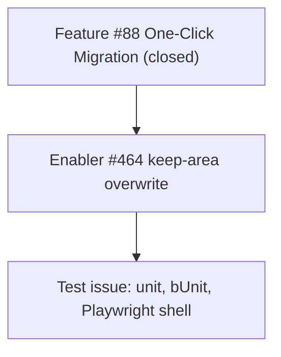

# One-Click Migration keep-`area/*` overwrite — project plan

**Issue:** [#464](https://github.com/markheydon/solo-dev-board/issues/464)  
**Milestone:** v1.1.0  
**Decision:** [DEC-036](DECISIONS.md#dec-036-one-click-migration-label-overwrite-keeps-area-by-default)  
**Parent feature:** Closed [#88](https://github.com/markheydon/solo-dev-board/issues/88) (catch-up; no new Feature wrapper — [DEC-027](DECISIONS.md#dec-027-post-10-milestone-and-work-item-hierarchy)).  
**Wireframe:** [wireframes/one-click-migration-wireframe.md](wireframes/one-click-migration-wireframe.md)

## Feature summary

Label Manager already keeps `area/*` labels during extra cleanup when **Keep `area/*` labels** is on (DEC-034). One-Click Migration Overwrite still treats every target-only label as a delete, so a source catalogue that omits `area/*` can wipe those names on the target. This slice aligns overwrite preview and apply with the same hard-coded `area/` rule.

## Success criteria

- Overwrite label preview and apply exclude `area/*` target-only labels from deletes by default.
- Operators can uncheck the nested control to restore previous overwrite deletes for `area/*`.
- Skip and Merge are unchanged.
- User Guide documents the behaviour.

## Work item hierarchy

## Technical approach

- Reuse `LabelTaxonomyPrefixes.IsAreaLabel` in `MigrationService.BuildLabelPreview` (and the matching apply path).
- Add a `keepAreaLabels` flag defaulting to `true` on preview and apply (new parameter with a default so existing callers keep compile).
- When Overwrite is selected and keep is on, move matching target-only labels into `KeptAreaLabels` instead of `ToDelete`.
- App layer: nested `MudCheckBox` **Keep `area/*` labels** when Labels scope is on and conflict strategy is Overwrite. Prefer MudBlazor utilities; do not add a new page.
- Do not thread the flag through milestone or Status-column preview.

## Out of scope

- Configurable keep-prefix lists in app settings.
- Changes to milestone or Status column overwrite.
- Reopening Feature #88 or creating a new Feature wrapper.

## Risks

- Existing Application tests assert Overwrite delete lists without `area/*` fixtures; add explicit cases rather than weakening current assertions.
- Playwright CI uses placeholder auth; destructive apply coverage stays in unit tests.
