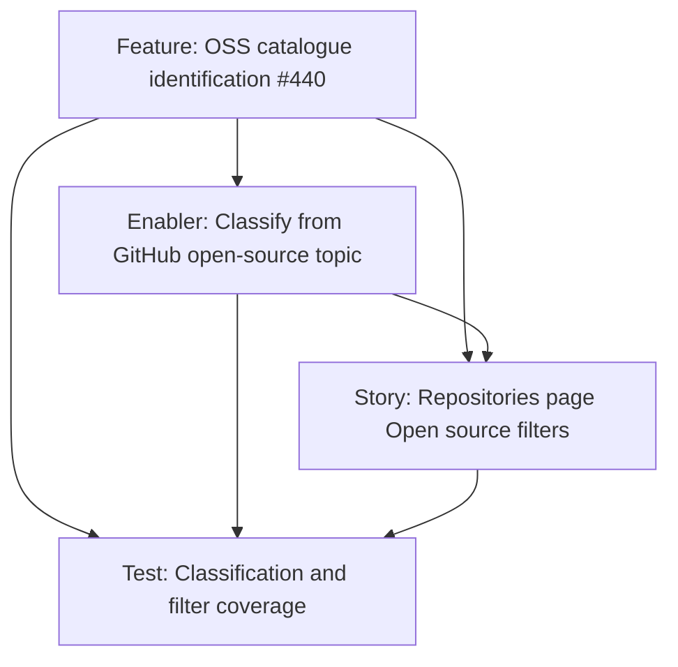

# OSS catalogue identification — project plan

## Feature summary

Give SoloDevBoard a single, deterministic rule for which catalogue repositories are **open-source project repos**. Classification comes from the GitHub repository topic `open-source`. The Repositories page exposes that rule as built-in **Open source** and **Not open source** filters. Later overnight scanners ([#438](https://github.com/markheydon/solo-dev-board/issues/438), [#439](https://github.com/markheydon/solo-dev-board/issues/439)) and repository groups ([#381](https://github.com/markheydon/solo-dev-board/issues/381)) must consume the same classification.

Parent Feature: [#440](https://github.com/markheydon/solo-dev-board/issues/440). No parent epic. Milestone: **`v1.1 - Cross-Repo Planning & Refinement`**. Decision: [DEC-032](DECISIONS.md#dec-032-oss-catalogue-identification-from-the-github-open-source-topic).

## Success criteria

- Every catalogue repository has a deterministic OSS / non-OSS classification.
- Repositories whose GitHub `topics` include `open-source` are OSS. Public visibility alone is not sufficient.
- The Repositories page default list remains the full catalogue. Built-in filters can restrict to OSS or to the complement.
- Application-layer helpers expose the same rule so future scanners do not invent a parallel include-list.
- User-facing copy uses **Open source** / **Not open source** (not `OSS` in the UI).

## Key milestones

1. Planning artefacts, wireframe update, DEC-032, GitHub child issues.
2. Carry GitHub `topics` into Domain and Application; implement the canonical classifier.
3. Repositories page filter strip (`MudToggleGroup`).
4. Tests and User Guide alignment.

## Risks

| Risk | Mitigation |
|------|------------|
| GitHub Search lag after topic edits | Prefer list-repos `topics`; do not use Search as the primary path. |
| Operators confuse public with open source | Document and test that private repos with the topic are OSS and public repos without it are not. |
| Duplicate OSS rules in later features | Export one Application classifier; #381 / #438 / #439 consume it. |
| Empty `topics` on list endpoints | Map the `topics` array from `GET /user/repos` (API version `2022-11-28`); add an infrastructure test that a payload with `topics` is not dropped. |

## Work item hierarchy

## Priority and estimate

| Item | Priority | Size |
|------|----------|------|
| Feature #440 | `priority/low` | `size/m` |
| Enabler | `priority/low` | `size/m` |
| Story | `priority/low` | `size/s` |
| Test | `priority/low` | `size/s` |

## Out of scope for this increment

- Repository group CRUD, persistence, or shared `RepositorySelector` group pickers ([#381](https://github.com/markheydon/solo-dev-board/issues/381)).
- Overnight Community Standards or FUNDING scanners ([#438](https://github.com/markheydon/solo-dev-board/issues/438), [#439](https://github.com/markheydon/solo-dev-board/issues/439)).
- Writing the `open-source` topic back to GitHub from SoloDevBoard.
- Treating `oss` as an equivalent topic.
- Using GitHub Search as the catalogue source of truth.

## Implementation references

- Wireframe: [`plan/wireframes/repositories-wireframe.md`](wireframes/repositories-wireframe.md)
- Decision: [DEC-032](DECISIONS.md#dec-032-oss-catalogue-identification-from-the-github-open-source-topic)
- User Guide (update during delivery): [`website/content/docs/repositories.md`](../website/content/docs/repositories.md)
