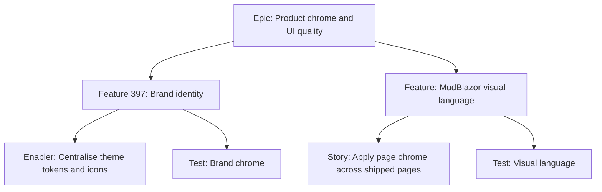

# Product chrome and UI quality — project plan

## Project overview

**Feature summary:** SoloDevBoard’s features work, but the Blazor UI still reads as a functional catalogue of papers and spinners. This plan splits **brand identity** (ice-box [#397](https://github.com/markheydon/solo-dev-board/issues/397)) from **visual language** (apply MudBlazor 9.9 page chrome so the app feels like one product). Agent guidance is updated in the `mudblazor` skill so future delivery does not keep inventing raw layout.

**Success criteria:**

- Agents pick `MudToolBar`, `MudSkeleton`, `MudAlert`, `MudSplitPanel`, and `MudDateRangePicker` from the skill instead of ad-hoc papers and dual date fields.
- Shipped pages share header, toolbar, loading, empty, and error patterns (DEC-039).
- Branding (#397) remains parked until a logo decision; tokens from the styling audit are ready to apply when it is un-parked.

**Key milestones:** Skill and decisions land with planning. UX language is implementation-ready and unmilestoned. Branding stays ice-box.

**Risks:** A full-page restyle can churn Playwright locators and docs screenshots. Mitigate by keeping `data-testid` values and treating screenshot recapture as part of the test issue.

## Review inputs

### Issue #397

Parked branding feature. Interim favicon is enough; proper identity is not a v1.3 gate.

### Human comments on #397

- Maintainer asked for a styling audit (custom CSS vs theme tokens vs duplicated icons).
- Maintainer posted the full inventory: four justified stylesheets; risk is duplicated tokens and chrome, not MudBlazor overrides.

### Bot comments on #397

- Cursor agent: custom CSS is small; branding risk is tokens and chrome in several places; no code changes in that pass.

### Pull request #398 (References #397)

Merged favicon swap. **No issue comments, no reviews, and no inline review threads** from humans or bots. CI checks on the head commit succeeded (build/test, both Playwright jobs, CodeQL, deploy list-steps). The PR body states it does **not** implement branding and leaves #397 ice-box.

## Work item hierarchy

The first pass of the MudBlazor skill (9.9.0 inventory, UX-LANGUAGE.md, chooser updates) is done in this planning change-set so the UX story is not blocked on agent docs.

## Priority

| Item | Priority | Notes. |
|------|----------|--------|
| Visual language story | `priority/medium` | Unmilestoned `status/todo`. Promote to v1.3 only if dogfood says chrome is blocking daily use. |
| Branding #397 | `priority/low` | `status/ice-box`. |
| Token / CSS enabler #529 | `priority/low` | Child of #397 (not a GitHub blocker of the parent). Centralise tokens and remove MudBlazor-overriding CSS where possible. |

## MudBlazor

Follow DEC-039 and `.agents/skills/mudblazor/references/UX-LANGUAGE.md`. Prefer `MudToolBar`, `MudSkeleton`, `MudAlert`, `MudCard`/`MudPaper` elevation 1. Do not add FABs, charts, or carousels.
