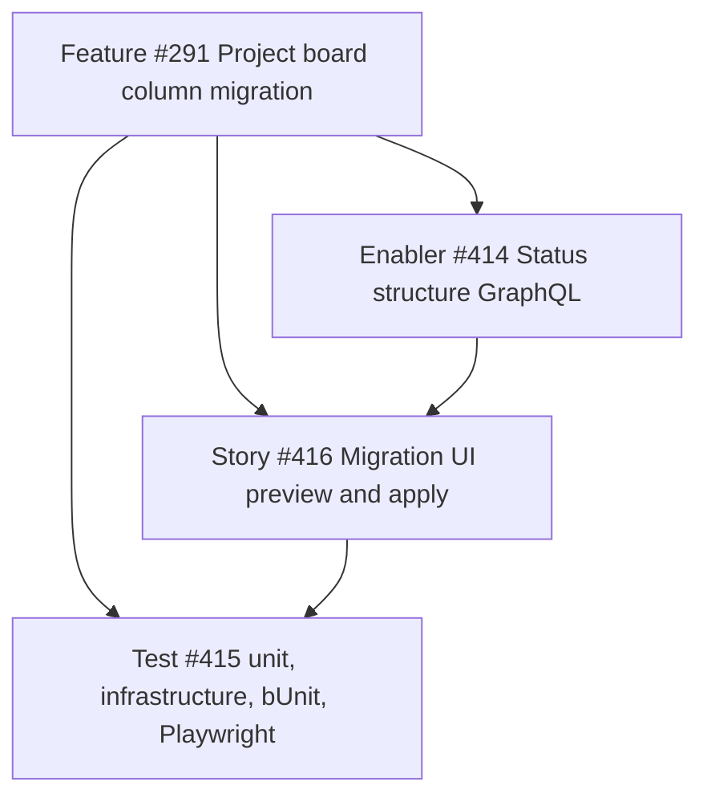

# Project board column migration — project plan

## Project overview

### Feature summary

Extend the shipped One-Click Migration workflow ([#88](https://github.com/markheydon/solo-dev-board/issues/88), labels and milestones) so a solo developer can copy **Projects v2 Status column structure** from a source repository board to one or more target repositories. Tracked as feature [#291](https://github.com/markheydon/solo-dev-board/issues/291) on milestone **v1.1.0**.

ADR-0013 / [DEC-010](DECISIONS.md#dec-010-one-click-migration-scope-and-preview-strategy) deferred this slice because Projects v2 GraphQL was not in the solution. Read and item-write GraphQL now exist (Triage, Board Rules, Cross-Repo Planning). This feature adds **field-structure writes**: Status single-select options, and creating a linked board when a target has none.

[#291](https://github.com/markheydon/solo-dev-board/issues/291) is promoted from a stub story to a Feature with no parent Epic (DEC-027 catch-up: it completes shipped feature #88 rather than opening a new epic). Closed epic [#87](https://github.com/markheydon/solo-dev-board/issues/87) stays closed.

### Success criteria

- The Migration page includes a **Project board columns** scope toggle alongside Labels and Milestones.
- Preview-first apply remains mandatory ([DEC-010](DECISIONS.md#dec-010-one-click-migration-scope-and-preview-strategy)).
- Status option names, colours, descriptions, and order on the target Status field match the selected source board after apply, subject to the chosen conflict strategy.
- A target with no usable linked board can receive a **new** repository-linked Projects v2 board whose Status options match the source.
- Inaccessible private user-owned boards under GitHub App sign-in reuse the existing warning; [#293](https://github.com/markheydon/solo-dev-board/issues/293) stays out of scope.
- User guide `website/content/docs/one-click-migration.md` describes the new scope; Playwright `migrate.spec.ts` asserts the extra controls and empty/error shells.

### Key milestones (no calendar dates)

1. Enabler: GraphQL structure read/write and Application migration contracts.
2. Story: Migration page board selection, preview tables, apply, create-if-missing.
3. Tests, user guide, E2E alignment, docs-capture screenshot refresh.

### Risk assessment

| Risk | Mitigation |
|------|------------|
| `updateProjectV2Field` replaces the entire option list and drops item Status if existing option ids are omitted. | Always send preserved target option ids for name matches. Spike-confirm the current GitHub.com schema in the enabler before UI work. |
| Community reports that field-option updates are unreliable or missing. | Enabler exit gate: a failing spike parks the story behind a documented API limitation rather than shipping a dead toggle. |
| Overwrite deleting unused Status options can fail when items still use them. | Do not remove options that still have items; report skipped-with-warning. |
| Hosted GitHub App cannot write private user-owned boards. | Same as Triage: warning + PAT mode with `project` (write) scope. Do not invent a second credential path (#293). |
| `createProjectV2` default Status options (Todo / In Progress / Done) collide with source names. | Treat create-then-reshape as merge/overwrite of the default field, matching by name. |
| PAT docs currently list `read:project` only. | Operator docs must add write `project` for this feature. |

## In scope

- GitHub **Projects v2** boards linked to repositories (same discovery model as Triage and Board Rules).
- The **Status** single-select field only (the board-view columns).
- Preview and apply of create / update / skip / (safe) delete of Status options.
- Creating one new linked project on a target when the user chooses “Create a new board” or the target has no supported board.
- Conflict strategies Skip, Merge, and Overwrite, mapped onto Status options (see [DEC-032](DECISIONS.md#dec-032-project-board-column-migration-is-status-structure-on-projects-v2)).

## Out of scope

- Classic (Projects v1) column boards.
- Copying cards, draft issues, views, workflows/automations, iteration fields, number fields (including Focus Order), or any custom field other than Status.
- `copyProjectV2` full-board clone.
- Linking an existing user-owned board onto additional repositories as a substitute for copying structure.
- Fixing private user-owned Projects v2 access under GitHub App sign-in ([#293](https://github.com/markheydon/solo-dev-board/issues/293)).

## Work item hierarchy

## Technical approach

### Layers

- **Domain:** extend Status option records with colour and description where needed; keep GitHub node ids as strings.
- **Application:** extend `MigrationScopeDto`, preview/result DTOs, and `IMigrationService`. Add an `IProjectBoardStructureRepository` (or equivalent) at the repository boundary returning domain records. Map to DTOs in the migration service only ([DEC-008](DECISIONS.md#dec-008-boundary-data-shapes--dtos-at-applicationapp-boundary)).
- **Infrastructure:** GraphQL `createProjectV2` (with `repositoryId`), Status field discovery, and `updateProjectV2Field` / `createProjectV2Field` as confirmed by the spike. Reuse `GetProjectBoardsForRepositoryAsync` for discovery.
- **App:** existing `/migrate` page. MudBlazor `MudSwitch`, `MudSelect`, preview tables, `MudAlert`, `ISnackbar`. Prefer utility classes. Do not put GraphQL or conflict math in Razor.

### Conflict mapping for Status options

Match options by name, ordinal ignore case.

| Strategy | Create missing | Update colour/description/order on name match | Target-only options |
|----------|----------------|-----------------------------------------------|---------------------|
| Skip | Yes | No | Keep |
| Merge | Yes | Yes | Keep |
| Overwrite | Yes | Yes | Remove only when no items use them; otherwise skip with warning |

### MudBlazor

| Region | Prefer | Avoid |
|--------|--------|-------|
| Scope | Third `MudSwitch` on the existing scope card | A second migration page |
| Boards | `MudSelect` per source and per target; create-new option | Raw HTML `<select>` |
| Preview | Per-target `MudPaper` + tables, same pattern as labels | Custom CSS grid |
| Access | Existing inaccessible-board `MudAlert` copy | A unique warning design |

## Test strategy (summary)

- **Application:** preview/apply matrices for Skip/Merge/Overwrite, create-board path, inaccessible board, no Status field.
- **Infrastructure:** GraphQL fixtures for discovery, create project, update field options (including “must retain option ids”).
- **bUnit:** scope switch, board selectors, preview locked until board chosen, overwrite warning extended for columns.
- **Playwright:** `migrate.spec.ts` shell includes the columns switch; CI remains placeholder-auth (empty/error). Docs-capture screenshot after UI lands.

## Documentation

- Update `website/content/docs/one-click-migration.md` (remove “later slice” scope notes once shipped).
- Update `tests/E2E/USER_DOCS_ALIGNMENT.md` and `CRITICAL_JOURNEYS.md`.
- Update `docs/getting-started.md` and `docs/deployment.md` for PAT `project` write scope.
- GitHub App operator notes: repository and organisation **Projects: Write** if hosted apply is expected to succeed on accessible boards.

## Decisions

- [DEC-010](DECISIONS.md#dec-010-one-click-migration-scope-and-preview-strategy) — preview-first migration.
- [DEC-032](DECISIONS.md#dec-032-project-board-column-migration-is-status-structure-on-projects-v2) — Status-structure slice definition.
