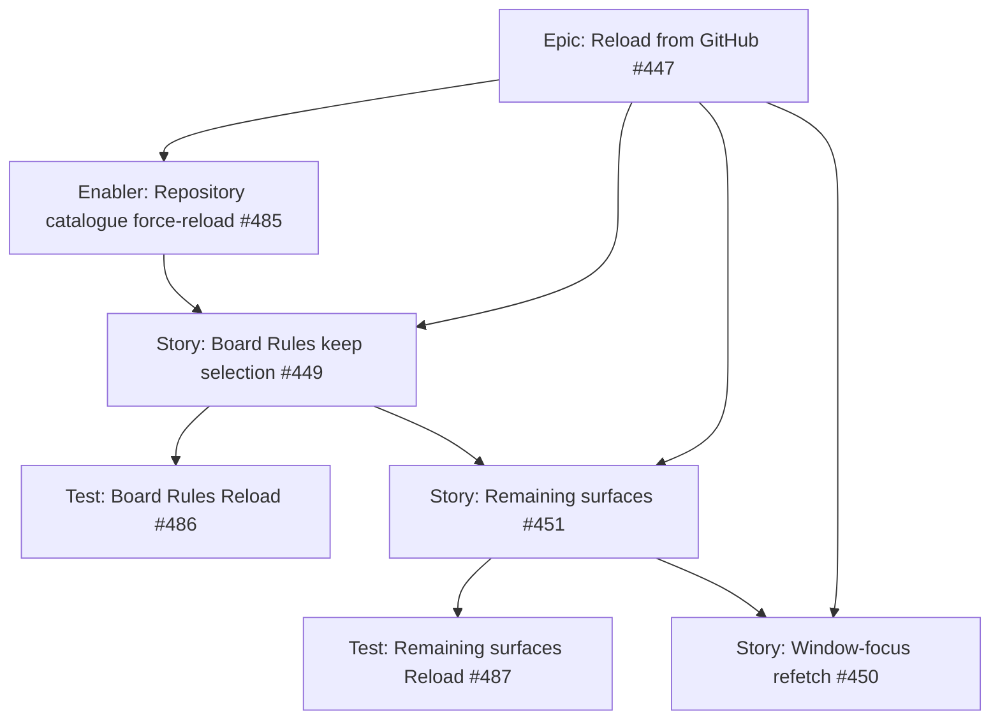

# Reload from GitHub, keep selection — project plan

## Feature summary

Give GitHub-backed feature pages a **Reload from GitHub** action that keeps pickers and in-page context, plus **Try again** on empty and error states the user can fix on GitHub. Full-page refresh must not be the only way to see a newly added Project Status field (or similar GitHub-side change).

Epic [#447](https://github.com/markheydon/solo-dev-board/issues/447) on milestone **`v1.2 - Planning polish, Reload & Templates`**. First dogfood slice is Board Rules ([#449](https://github.com/markheydon/solo-dev-board/issues/449)). Remaining nav surfaces follow in [#451](https://github.com/markheydon/solo-dev-board/issues/451). Window-focus auto-refetch ([#450](https://github.com/markheydon/solo-dev-board/issues/450)) stays ice-boxed and unmilestoned.

No new architecture decision. Reuse Planning `forceReload` and existing `GitHubResponseCache` invalidation (labels and milestones already invalidate; repositories do not).

## Success criteria

- On Board Rules, Reload from GitHub keeps the primary repository (and comparison repository when compare mode is on) and refetches project boards from GitHub.
- The unsupported-board empty state offers Try again with the same keep-selection behaviour.
- Loading is scoped to the section that is refetching (`MudProgressCircular` already used for board loads).
- The repository catalogue can be force-reloaded through Application APIs without App referencing Infrastructure.
- There is still no global app-bar “refresh everything” control.
- User Guide and Playwright stay aligned for changed pages.

## Key milestones

1. Enabler: repository catalogue force-reload ([#485](https://github.com/markheydon/solo-dev-board/issues/485)).
2. Board Rules UI and docs ([#449](https://github.com/markheydon/solo-dev-board/issues/449)) plus tests ([#486](https://github.com/markheydon/solo-dev-board/issues/486)).
3. Remaining surfaces ([#451](https://github.com/markheydon/solo-dev-board/issues/451)) plus tests ([#487](https://github.com/markheydon/solo-dev-board/issues/487)).
4. Later, off `v1.2`: window-focus refetch ([#450](https://github.com/markheydon/solo-dev-board/issues/450)).

## Risks

| Risk | Mitigation |
|------|------------|
| Reload repositories today clears Board Rules selection (`LoadRepositoriesAsync` resets pickers). | Add a keep-selection reload path; do not reuse the current full reset for page-level Reload. |
| Repository catalogue TTL hides new repos after a GitHub-side change. | Enabler #485 invalidates user/owner repository cache keys before refetch. |
| Delivery assumes project-board discovery is cached. | It is not (`GetProjectBoardsForRepositoryAsync` is a live GraphQL read). Do not add a board-discovery cache in this increment. |
| Copying Planning chrome onto Board Rules. | Use the *idea* (keep context, bust reads, section loading). Prefer a `MudButton` in the selector header, not the Planning icon-button chrome. |
| Rate limits from later focus refetch. | Keep #450 ice-boxed; do not auto-refetch on tab focus in #449 or #451. |

## Work item hierarchy

There is **no Feature issue** in this tree. #451 is a Story (one delivery unit spanning several pages). A Feature that only parents test #487 would violate [DEC-027](DECISIONS.md#dec-027-post-10-milestone-and-work-item-hierarchy) (Features group two or more stories or enablers). Shared enabler #485 sits on the epic because both #449 and #451 need the catalogue force-reload.

## GitHub issues breakdown

| Issue | Type | Priority | Size | Notes |
|-------|------|----------|------|-------|
| [#447](https://github.com/markheydon/solo-dev-board/issues/447) | Epic | low | l | Pattern owner. |
| [#485](https://github.com/markheydon/solo-dev-board/issues/485) | Enabler | medium | s | Blocks #449. |
| [#449](https://github.com/markheydon/solo-dev-board/issues/449) | Story | medium | m | First UI slice. Blocks #451 and #486. |
| [#486](https://github.com/markheydon/solo-dev-board/issues/486) | Test | medium | s | Board Rules bUnit and Playwright. |
| [#451](https://github.com/markheydon/solo-dev-board/issues/451) | Story | low | l | One issue for remaining pages. Blocks #487. Not a Feature wrapper. |
| [#487](https://github.com/markheydon/solo-dev-board/issues/487) | Test | low | m | Remaining surfaces. |
| [#450](https://github.com/markheydon/solo-dev-board/issues/450) | Story | low | m | Ice-box; not a `v1.2` close-out gate. |

## Shared implementer pattern

Documented here so Delivery does not invent a new pattern per page:

1. Keep current pickers (and search or filter context).
2. Invalidate **this page's** cached GitHub reads (repository catalogue via #485; other catalogues via existing invalidation where they exist).
3. Refetch; show `MudProgressCircular` (or existing section progress) on the refetching region only.
4. GitHub-fixable empty and error states include Try again with the same path.
5. Do not run Reload during an in-flight write on that page.
6. Do not add a global app-bar control.

**Behavioural reference:** Planning shell refresh (`PlanningShell` / `PlanningChromeCoordinator.RefreshAsync(forceReload: true)`), not a copy of that layout. The filed `pm-workflow-refresh-button` test id is stale; Planning uses an icon button with aria-label **Refresh Planning data**.

**MudBlazor:** `MudButton` (Filled, Secondary) in the selector `MudStack` header row; reuse existing loading `MudProgressCircular` and `MudAlert` patterns. Prefer `Class` utility spacing. No new `.razor.css` for this control.

## Board Rules first slice (technical notes)

- Page-level **Reload from GitHub** sits in `board-rules-selector-region` next to the compare-mode switch.
- It must not call today's `LoadRepositoriesAsync` as written, because that method clears `selectedRepository` and comparison state.
- Keep selected full names; optionally refresh the repository list with force-reload; if the selected repo is still in the catalogue, refetch `GetProjectBoardOptionsAsync` for primary and comparison; if a board id is still in the new options, refetch visualisation.
- **Try again** on `board-rules-unsupported-boards-message` (and comparison equivalent) refetches boards only, keeping the repository.
- Existing **Try loading repositories again** / **Try loading project boards again** on *error* states stay; align them with cache-busting and keep-selection where they currently reset more than needed.
- Board Rules is read-only today; in-flight write gating is a no-op until a write exists.

## Remaining surfaces inventory (#451)

Corrected from current `NavMenu` routes (not `/workflows` or `/pm-workflow`):

| Surface | Route | Notes |
|---------|-------|--------|
| Labels | `/labels` | Align existing repository reload so it does not wipe taxonomy pickers; bust label cache already exists on writes. |
| Triage | `/triage` | Keep repository and board pickers. |
| Repositories | `/repositories` | Already has Refresh and Try again; confirm catalogue force-reload and keep search or filter context; rename copy to Reload from GitHub only if it stays clear. |
| Actions Templates | `/actions-templates` | Keep repository and template selection; do not interrupt an in-flight apply. |
| Audit Dashboard | `/audit-dashboard`, `/audit` | Explicit Reload that keeps the repository filter; auto-refresh must not replace user-triggered cache-busting; Try again on load failure. |
| Migrate | `/migrate` | Keep source, target, and related pickers; do not reload during an in-flight migration. |
| Planning | `/planning` | Out of scope (reference only). |
| Home, About | `/`, `/about` | Out of scope. |

## Out of scope for this increment

- Global app-bar refresh.
- Window or tab focus refetch (#450).
- Caching project-board GraphQL discovery.
- Full GitHub automation-rule retrieval (#437).
- Custom template repositories (#292), Daily Focus board-scope (#403), HttpClient split (#453).
- Hosted private Projects v2 (#293).

## Implementation references

- Wireframe: [`plan/wireframes/board-rules-visualiser-wireframe.md`](wireframes/board-rules-visualiser-wireframe.md)
- User Guide (update during #449 delivery): [`website/content/docs/board-rules-visualiser.md`](../website/content/docs/board-rules-visualiser.md)
- E2E alignment: [`tests/E2E/USER_DOCS_ALIGNMENT.md`](../tests/E2E/USER_DOCS_ALIGNMENT.md)
- Cache: `src/Infrastructure/SoloDevBoard.Infrastructure/GitHub/GitHubResponseCache.cs`
- Board Rules page: `src/App/SoloDevBoard.App/Components/Features/BoardRules/Pages/BoardRules.razor`
