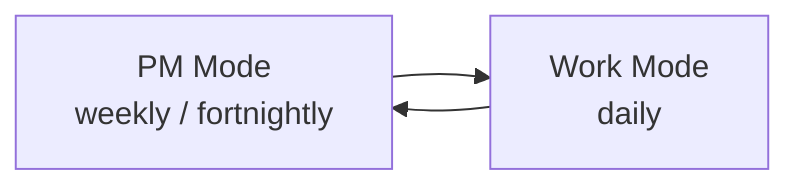

## Single pane of glass

SoloDevBoard exists to reduce context-switching for solo developers who maintain several GitHub repositories. Routine work — triaging issues, keeping labels consistent, checking workflow health, and understanding project board rules — is scattered across repositories and GitHub's own UI. The goal is one cohesive place to see and act on that workload.

## Lineage from github-workflows

The project was directly inspired by the AI-driven PM workflow in the companion repository [markheydon/github-workflows](https://github.com/markheydon/github-workflows). That system uses structured prompts and automation around two operating modes:

- **PM Mode** (weekly or fortnightly) — scan repositories, triage issues and pull requests, and curate a project board.
- **Work Mode** (daily) — pick the next item from a pre-curated board and execute.

SoloDevBoard provides a visual interface for the same operating system: cross-repo backlog review, daily focus, iteration planning, and repository participation. Individual tooling features (audit, labels, triage, and related pages) remain first-class; **Planning** brings the two-mode loop into the app.

## What ships today

The [User Guide](/docs/) documents the features available in tagged releases. The landing page lists the same capabilities — nothing is advertised there that is not covered by a published guide page.
